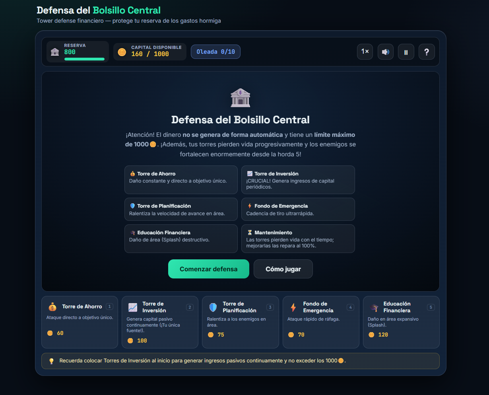
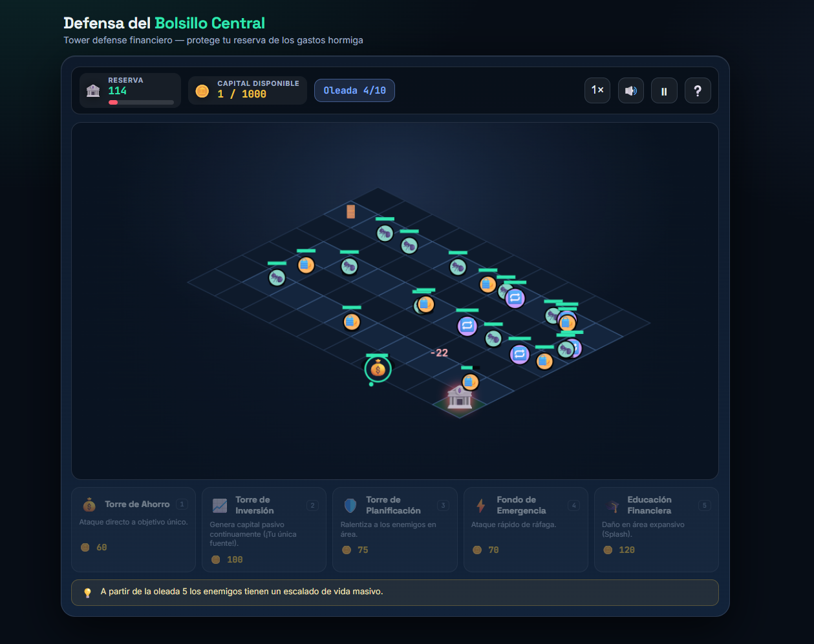
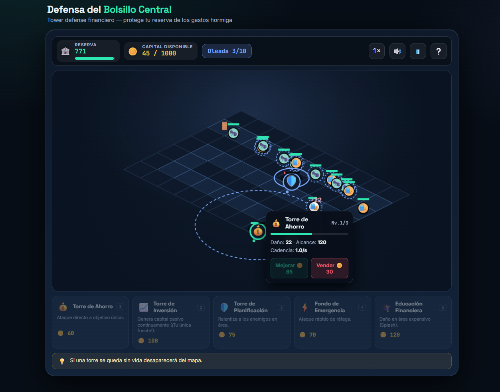
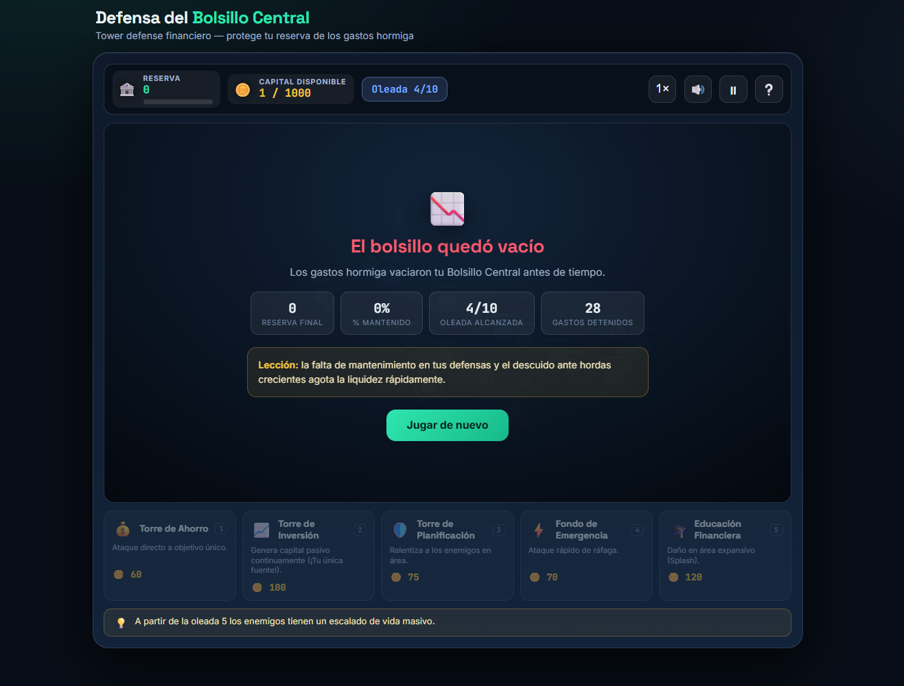

  # 💰 DEFENSA DEL BOLSILLO CENTRAL

  
  
  

  *Protege tu estabilidad financiera construyendo defensas, administrando recursos y enfrentando las amenazas del gasto descontrolado.*

## 📖 Descripción General

**Defensa del Bolsillo Central** es un videojuego web educativo de estrategia en tiempo real basado en la mecánica **Tower Defense**, diseñado para enseñar conceptos básicos de educación financiera mediante una experiencia interactiva.

El jugador debe proteger su **Centro Financiero Personal** administrando correctamente un presupuesto limitado mientras enfrenta constantes amenazas económicas como gastos inesperados, deudas y obligaciones financieras que intentan debilitar su estabilidad económica.

A través de la construcción estratégica de estructuras defensivas, el jugador aprende la importancia del ahorro, la inversión y la planificación de recursos para mantener unas finanzas equilibradas.

---

## 🎯 Objetivo del Jugador

Resistir las diferentes oleadas de amenazas económicas protegiendo el **Bolsillo Central**, evitando que los gastos y deudas destruyan la base financiera.

El jugador debe administrar cuidadosamente sus monedas disponibles, construir estructuras defensivas, realizar mejoras y mantener un flujo constante de ingresos para sobrevivir hasta la última oleada.

---

## 🧩 Mecánica Principal

El juego combina estrategia, administración de recursos y defensa táctica mediante un sistema de torres:

* **Sistema Tower Defense Isométrico:**  
  El jugador construye defensas sobre una cuadrícula con perspectiva isométrica 2D, colocando estructuras estratégicamente para detener el avance de los enemigos financieros.

* **Gestión de Presupuesto Limitado:**  
  El jugador comienza con un capital inicial y debe tomar decisiones inteligentes, ya que existe un límite máximo de acumulación de dinero. Gastar demasiado puede impedir futuras mejoras o reparaciones.

* **Sistema de Durabilidad y Mantenimiento:**  
  Las estructuras defensivas pierden resistencia progresivamente con el tiempo. El jugador debe invertir recursos para repararlas y mejorar su eficiencia.

* **Sistema de Inversión Financiera:**  
  Las torres no solo sirven para atacar; algunas funcionan como fuentes de ingresos que permiten generar recursos adicionales para mantener la defensa activa.

* **Oleadas de Amenazas Económicas:**  
  Cada ronda aumenta la dificultad incorporando enemigos con mayor resistencia y nuevas situaciones financieras hasta llegar al enfrentamiento final.

---

# 🎮 Género y Estilo

* **Géneros:** Tower Defense / Estrategia / Educativo

* **Estilo Visual:**  
  Representación isométrica 2D con una interfaz inspirada en la administración financiera. Utiliza elementos visuales relacionados con monedas, estructuras defensivas, barras de vida, estadísticas económicas y efectos dinámicos.

* **Público Objetivo:**  
  Jóvenes, estudiantes y personas interesadas en aprender conceptos básicos de administración financiera mediante una experiencia de juego estratégica.

---

# ⌨️ Controles e Instrucciones

El juego utiliza interacción directa mediante mouse o pantalla táctil:

| Acción | Control |
|---|---|
| **Seleccionar casillas del mapa** | Clic izquierdo / Toque táctil |
| **Construir estructuras** | Seleccionar una casilla disponible y elegir una torre |
| **Mejorar estructuras** | Seleccionar una torre existente y utilizar recursos |
| **Reparar defensas** | Acceder al menú de mantenimiento |
| **Administrar recursos** | Controlar ingresos y gastos desde la interfaz |

---

## 🖼️ Capturas de Pantalla

| Vistas del Videojuego |
| :--- |
| **1. Pantalla Inicial / Menú Principal**  |
| **2. Momento de Gameplay y Mapa Isométrico**  |
| **3. Construcción y Mejora de Torres Defensivas**  |
| **4. Pantalla de Derrota Financiera**  |

---

# 🏦 Sistemas del Juego

## Construcción de Defensas

El jugador puede crear diferentes tipos de estructuras con funciones específicas:

### 💵 Ahorro Primario
Torre económica que permite defenderse de amenazas pequeñas mediante ataques constantes.

### 🛡 Fondo de Emergencia
Defensa especializada en ataques de área capaz de detener grupos de enemigos con mayor resistencia.

### 📈 Torre de Inversión
Estructura enfocada en generar ingresos periódicos para mantener el crecimiento económico durante la partida.

---

## 💸 Sistema Económico

El jugador debe mantener un equilibrio entre:

- Gastar recursos para construir defensas.
- Invertir para generar nuevos ingresos.
- Reparar estructuras dañadas.
- Evitar quedarse sin presupuesto disponible.

Una mala administración puede provocar la pérdida del centro financiero.

---

# ⚔️ Oleadas y Dificultad

El juego presenta un sistema progresivo de desafíos:

* **Primeras oleadas:**  
  Aparecen gastos pequeños y amenazas fáciles de controlar.

* **Oleadas intermedias:**  
  Incrementan la resistencia de los enemigos y requieren mejores estrategias económicas.

* **Oleada final:**  
  Aparece una amenaza financiera mayor que obliga al jugador a utilizar correctamente todas sus defensas y recursos acumulados.

---

# 🛠️ Tecnologías y Herramientas Utilizadas

* **HTML5 Canvas:**  
  Renderizado del mapa isométrico, estructuras defensivas, enemigos, efectos visuales y elementos del escenario.

* **CSS3:**  
  Diseño de interfaz, paneles de información, botones, animaciones y adaptación visual.

* **JavaScript (Vanilla):**  
  Implementación del motor del juego, generación de oleadas, sistema económico, construcción de torres, mejoras, mantenimiento y control de estados.

* **Web Audio API:**  
  Creación de efectos de sonido dinámicos mediante generación procedural de audio.

---

# 🤖 Elementos Desarrollados con Apoyo de IA

* **Diseño Conceptual y Mecánicas (Gemini)**
  * Creación de la temática de educación financiera aplicada a un sistema Tower Defense.
  * Diseño de enemigos económicos, estructuras defensivas y sistema de administración de recursos.
  * Definición del balance de dificultad y progresión de oleadas.

* **Programación y Desarrollo (Claude)**
  * Implementación del renderizado isométrico.
  * Desarrollo del sistema de construcción, mantenimiento y mejoras.
  * Creación de la lógica de oleadas, economía del jugador y efectos de sonido.

---

# 💡 Aprendizajes y Futuras Mejoras

## Principales Aprendizajes:

* Desarrollo de un videojuego estratégico basado en administración de recursos.
* Implementación de una cuadrícula isométrica utilizando HTML5 Canvas.
* Creación de sistemas combinados de economía, combate y progresión.
* Manejo de múltiples estados del juego dentro de un entorno interactivo.

## Mejoras planteadas para la versión 2.0:

* Añadir más tipos de amenazas financieras con diferentes comportamientos.
* Incorporar nuevos mapas y escenarios económicos.
* Crear un sistema de estadísticas del jugador y progreso financiero.
* Agregar efectos de sonido más avanzados y música ambiental.
* Implementar nuevos tipos de torres con habilidades especiales.
