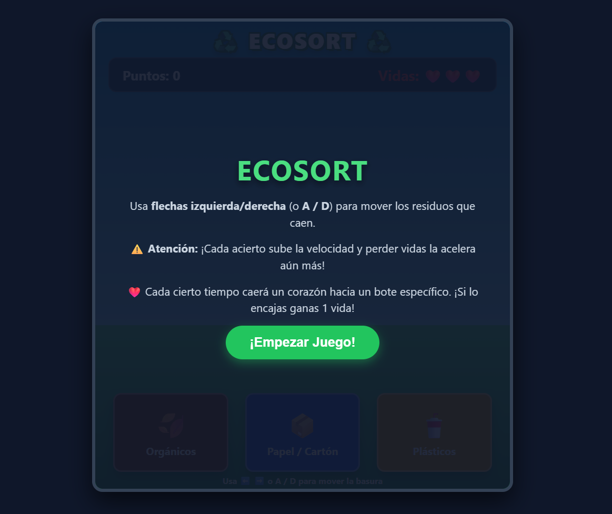
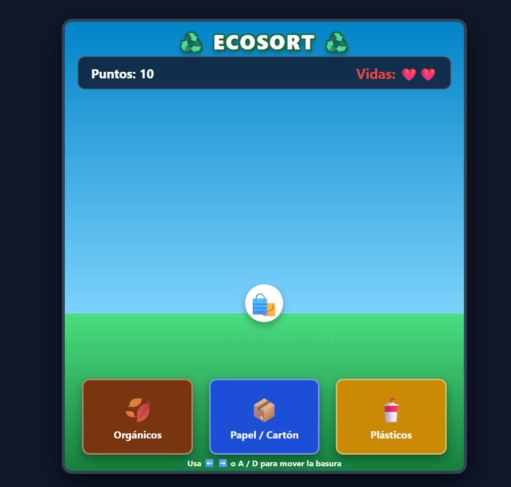
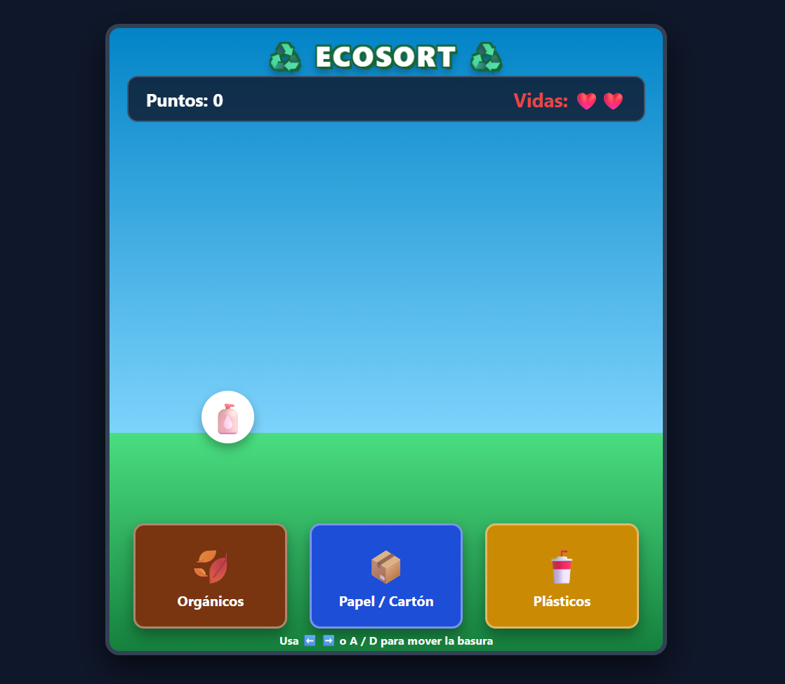
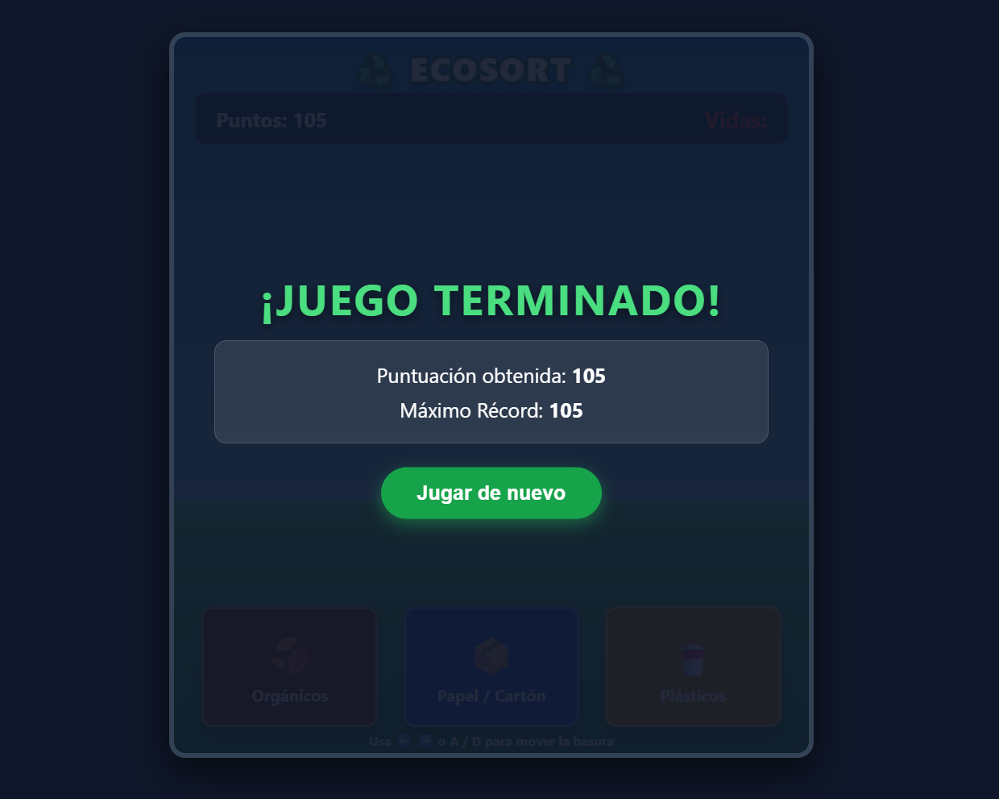
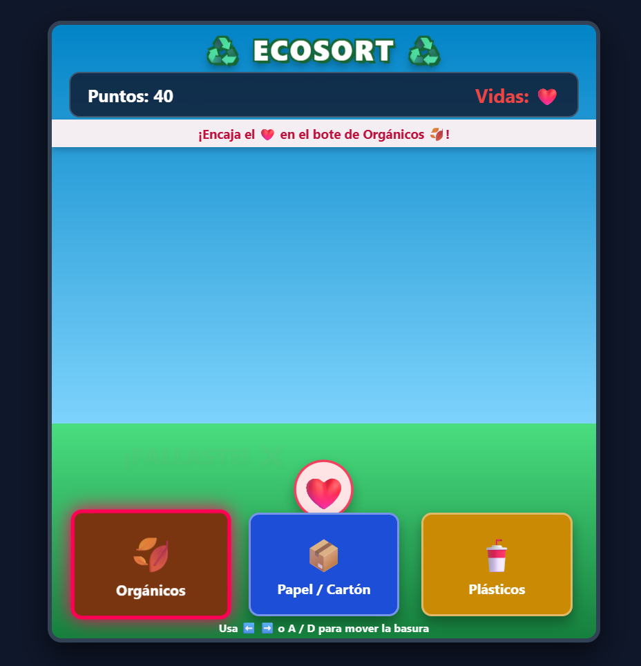

  # ♻️ ECOSORT: DESAFÍO DE RECICLAJE

  
  
  

  *Un desafío ágil de clasificación de residuos en tiempo real para promover la conciencia ambiental.*

---

## 📖 Descripción General

* **¿De qué trata?:** **EcoSort: Desafío de Reciclaje** es un videojuego web educativo diseñado como respuesta a la problemática planteada por la organización ambiental EcoAcción sobre la falta de hábito en la separación de residuos. El jugador controla el desplazamiento horizontal de distintos elementos contaminantes y orgánicos mientras caen desde la parte superior.
* **Objetivo del jugador:** Clasificar correctamente la mayor cantidad de residuos en sus contenedores correspondientes (Orgánicos, Papel/Cartón y Plásticos) para acumular puntos, conservar vidas y lograr la puntuación más alta.
* **Mecánica principal:** Desplazamiento lateral de residuos en caída libre continua con detección de colisión instantánea contra 3 botes de basura fijos. La velocidad se incrementa gradualmente con cada acierto y se aplican penalizaciones por equivocación.

---

## 🎮 Género y Estilo

* **Géneros:** Arcade / Educativo / Habilidad
* **Estilo Visual:** Interfaz adaptativa e ilustrativa con degradados coloridos, animaciones dinámicas CSS y efectos visuales Neón/Eco.
* **Público Objetivo:** Estudiantes, jóvenes y comunidad en general (11 a 16+ años).

---

## ⌨️ Controles

| Acción | Teclado | Ratón / Pantalla Táctil |
| :--- | :--- | :--- |
| **Mover a la izquierda** | `FLECHA IZQUIERDA` o Tecla `A` | Clic/Toque directo en pantalla|
| **Mover a la derecha** | `FLECHA DERECHA` o Tecla `D` | Clic/Toque directo en pantalla|
| **Iniciar / Reiniciar** | `ENTER` | Clic en el botón **¡Empezar Juego!** / **Jugar de nuevo**|

---

## 🖼️ Capturas de Pantalla

| Vistas del Videojuego |
| :--- |
| **1. Pantalla Inicial**  |
| **2. Momento de Gameplay**  |
| **3. Mecánica Principal**  |
| **4. Pantalla de Victoria / Récord**  |
| **5. Pantalla de Derrota (Game Over)**  |
| **6. Elementos Especiales (Evento del Corazón)**  |

---

## 🛠️ Tecnologías y Herramientas Utilizadas

* **HTML5 Canvas & DOM:** Estructura modular del escenario, interfaz HUD y overlays.
* **CSS3:** Degradados dinámicos, animaciones flotantes `@keyframes` (efectos pulse, floatTitle, highlightBin) y estilos adaptativos.
* **JavaScript (Vanilla):** Bucle de renderizado continuo (`requestAnimationFrame`), cálculo de física de caída, detección de cajas colisionables (`getBoundingClientRect`) y persistencia de datos mediante **LocalStorage API**.

---

## 🤖 Elementos Desarrollados con Apoyo de IA

* **Diseño Conceptual y Estructura Visual (Gemini):**
  * Definición de la experiencia pedagógica, la paleta cromática verde-ecológica y el diseño del flujo del usuario.
  * Planificación de la mecánica de eventos dinámicos (recuperación de salud con corazones).
* **Programación y Construcción de Código (Claude):**
  * Programación del motor de movimiento horizontal, aceleración de caída dinámica y lógica de cajas de colisión física.
  * Implementación del almacenamiento de récords mediante `localStorage` y cálculo de distractores de residuos.

---

## 💡 Aprendizajes y Futuras Mejoras

* **Principales Aprendizajes:**
  * Uso eficiente de `requestAnimationFrame` combinado con manipulación en tiempo real del DOM para físicas 2D fluidas.
  * Control de estados del juego (inicio, juego activo, pausa por muerte, game over) e integración de eventos especiales periódicos.
* **Mejoras planteadas para la versión 2.0:**
  * Integrar efectos de sonido (SFX) para aciertos, fallos y recolección de corazones.
  * Implementar nuevos tipos de contenedores (Vidrio, Electrónicos) para subir el nivel de desafío.
  * Sistema de combo por clasificación perfecta consecutiva.
