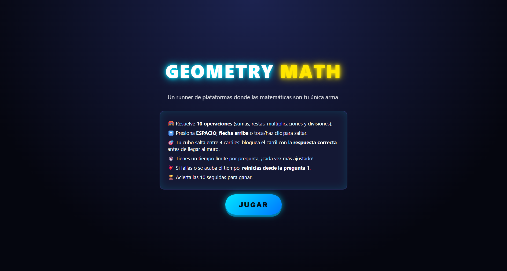

  # 🧮 GEOMETRY MATH

  
  
  

  *Un runner de plataformas veloz donde las matemáticas son tu única vía de escape.*

---

## 📖 Descripción General

* **¿De qué trata?** **Geometry Math** combina la dinámica frenética de los juegos de plataformas retro con el cálculo mental en tiempo real. El jugador controla a un cubo que avanza sin detenerse a través de un escenario neón mientras enfrenta operaciones matemáticas continuas.
* **Objetivo del jugador:** Resolver **10 operaciones matemáticas consecutivas** (sumas, restas, multiplicaciones y divisiones) sin cometer ningún error ni agotar la barra de tiempo.
* **Mecánica principal:** El personaje oscila constantemente entre 4 carriles verticales. El jugador debe calcular la respuesta matemática en pantalla y presionar la acción de salto en el instante exacto en que el cubo esté alineado con el bloque que contiene la respuesta correcta.

---

## 🎮 Género y Estilo

* **Géneros:** Arcade / Runner / Puzzle Educativo
* **Estilo Visual:** Neón Cyberpunk / Retro 2D con animaciones dinámicas en CSS3.

---

## ⌨️ Controles

| Acción | Teclado | Ratón / Pantalla Táctil |
| :--- | :--- | :--- |
| **Fijar respuesta / Saltar** | `ESPACIO` o `FLECHA ARRIBA` | Clic en la pantalla / Clic en el botón **⬆ SALTAR** |

---

## 🖼️ Capturas de Pantalla

> **Nota:** Guarda tus imágenes dentro de `GeometryMath/assets/` con estos nombres exactos para que carguen automáticamente.

### 1. Pantalla Inicial

### 2. Momento de Gameplay y Mecánica Principal
*Subir imagen:* `assets/gameplay.png` (Muestra al cubo desplazándose entre los 4 carriles con la barra de tiempo activa y la operación matemática).

### 3. Pantalla de Victoria
*Subir imagen:* `assets/pantalla-victoria.png` (Muestra el mensaje de ¡GANASTE! con el puntaje final 10/10).

---

## 🛠️ Tecnologías y Herramientas Utilizadas

* **HTML5 Canvas & DOM:** Estructuración de pantallas y elementos de interfaz.
* **CSS3:** Estilizado neón con variables CSS, animaciones mediante `@keyframes` y diseño *responsive*.
* **JavaScript (Vanilla):** Bucle principal de ejecución (`requestAnimationFrame`), lógica del algoritmo de cálculo matemático aleatorio y control de colisiones por tiempo.

---

## 🤖 Elementos Desarrollados con Apoyo de IA

* **Algoritmo de Distractores:** Optimización de la función `makeDistractors` en JS para generar respuestas incorrectas creíbles y cercanas al resultado real.
* **Efectos Neón y Animación:** Apoyo en la generación de reglas CSS para las animaciones de vibración (`shakeBad`), destello (`pulseGood`) y giro del cubo (`spinCube`).

---

## 💡 Aprendizajes y Futuras Mejoras

* **Principales Aprendizajes:**
  * Sincronización del bucle del juego (`gameLoop`) mediante estampa de tiempo (`performance.now()`).
  * Manipulación de la interfaz sin el uso de librerías externas.
* **Mejoras planteadas para la versión 2.0:**
  * Implementación de efectos de sonido (SFX) para aciertos, errores y saltos.
  * Selector de dificultades (Fácil, Normal, Difícil) con menor margen de tiempo por nivel.
  * Guardado de récords de tiempo en `localStorage`.
