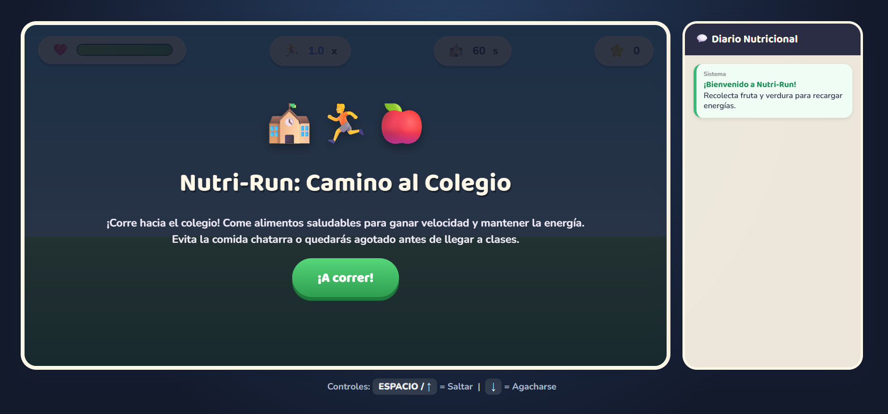
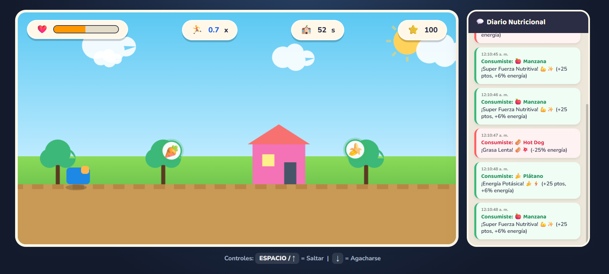
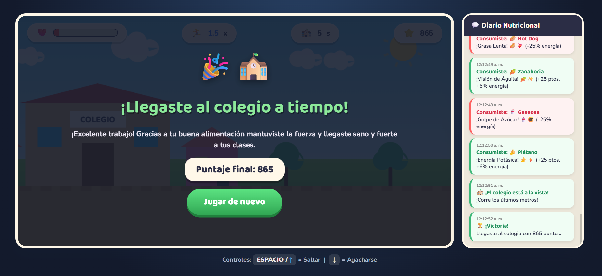
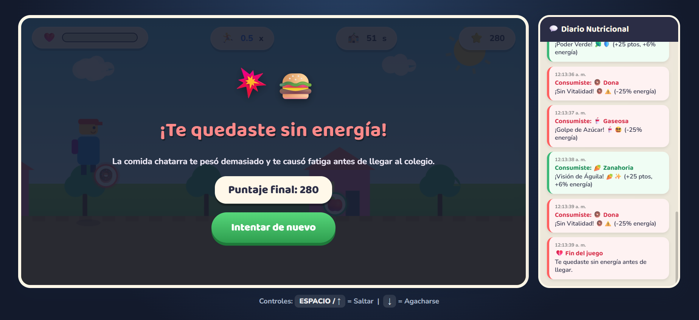
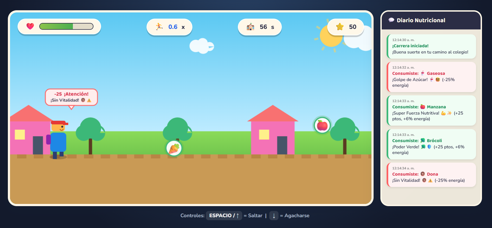

  # 🏃 NUTRI-RUN: CAMINO AL COLEGIO

  
  
  

  *Una carrera contra el tiempo y la mala alimentación para llegar sano y fuerte a clases.*

---

## 📖 Descripción General

* **¿De qué trata?:** **Nutri-Run: Camino al Colegio** es un videojuego web educativo desarrollado para concientizar a estudiantes en edad escolar sobre la alimentación saludable. El jugador controla a un estudiante que corre durante un trayecto de 60 segundos con dirección al colegio mientras decide en fracciones de segundo qué alimentos consumir.
* **Objetivo del jugador:** Llegar a la meta (el colegio) antes de que se agote el tiempo limite, conservando la barra de energía mediante el consumo de fruta y verdura, evitando perder vitalidad por comida chatarra.
* **Mecánica principal:** Desplazamiento y carrera automática. El personaje debe saltar o agacharse para atrapar alimentos saludables situados a distintas alturas o esquivar la comida ultraprocesada. Incorpora un **Diario Nutricional** en tiempo real que registra el impacto de cada alimento consumido.

---

## 🎮 Género y Estilo

* **Géneros:** Arcade / Endless Runner 2D / Educativo
* **Estilo Visual:** Gráficos vectoriales renderizados directamente en Canvas, con efectos de partículas, animaciones dinámicas y un panel lateral de chat interactivo.
* **Público Objetivo:** Niños y adolescentes en edad escolar (8 a 16+ años).

---

## ⌨️ Controles

| Acción | Teclado |
| :--- | :--- |
| **Saltar** | `BARRA ESPACIADORA` o `FLECHA ARRIBA` |
| **Agacharse** | `FLECHA ABAJO` |
| **Iniciar / Reiniciar** | Clic en el botón **¡A correr!** / **Jugar de nuevo** |

---

## 🖼️ Capturas de Pantalla

| Vistas del Videojuego |
| :--- |
| **1. Pantalla Inicial** * |
| **2. Momento de Gameplay** * |
| **3. Mecánica Principal (Salto y Agachado)** * |
| **4. Pantalla de Victoria** * |
| **5. Pantalla de Derrota (Fatiga)** * |
| **6. Elementos Especiales (Diario Nutricional Lateral)** * |

---

## 🛠️ Tecnologías y Herramientas Utilizadas

* **HTML5 Canvas API:** Dibujado dinámico del personaje, escenarios vectoriales, partículas y la estructura de la escuela.
* **CSS3 & Flexbox:** Maquetación del layout en dos columnas (juego + panel lateral) y animaciones tipo `@keyframes`.
* **JavaScript (Vanilla):** Sistema de físicas (gravedad, salto y agachado)[cite: 2], detección de colisiones por hitboxes, manejo de rachas (combos) y actualización del Diario Nutricional.

---

## 🤖 Elementos Desarrollados con Apoyo de IA

* **Diseño Conceptual y Flujo del Diario (Gemini):**
  * Conceptualización de la problemática planteada por la ONG VidaSana y diseño de la interfaz en dos columnas.
  * Definición del sistema de avisos nutricionales en tiempo real y la estética de la pista.
* **Programación y Renderizado Canvas (Claude):**
  * Programación del motor físico del jugador (saltos, agachado y estados de fatiga).
  * Renderizado del escenario vectorial (nubes, casas, sol y colegio) e implementación del sistema de partículas y globos flotantes.

---

## 💡 Aprendizajes y Futuras Mejoras

* **Principales Aprendizajes:**
  * Uso avanzado de la API de HTML5 Canvas para animar sprites y objetos mediante matemáticas puro y transformaciones.
  * Sincronización entre el bucle gráfico de Canvas y elementos DOM de la interfaz (HUD y chat lateral).
* **Mejoras planteadas para la versión 2.0:**
  * Incorporar efectos de sonido (SFX) para saltos, aciertos y fatiga.
  * Añadir obstáculos ambientales adicionales (charcos, tráfico) para mayor variedad de gameplay.
  * Crear diferentes rutas/escenarios hacia el colegio con niveles de dificultad progresivos.
