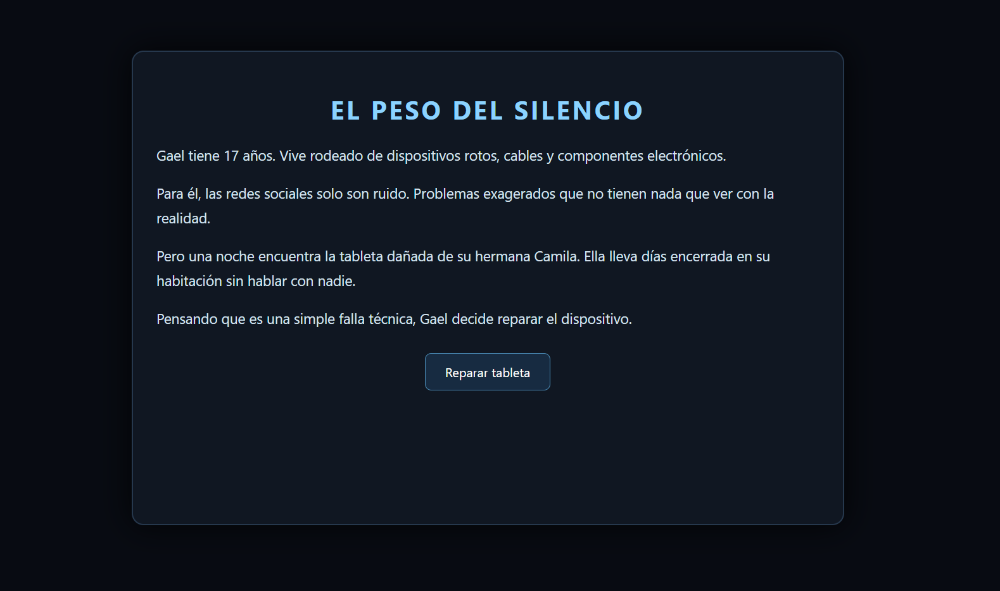
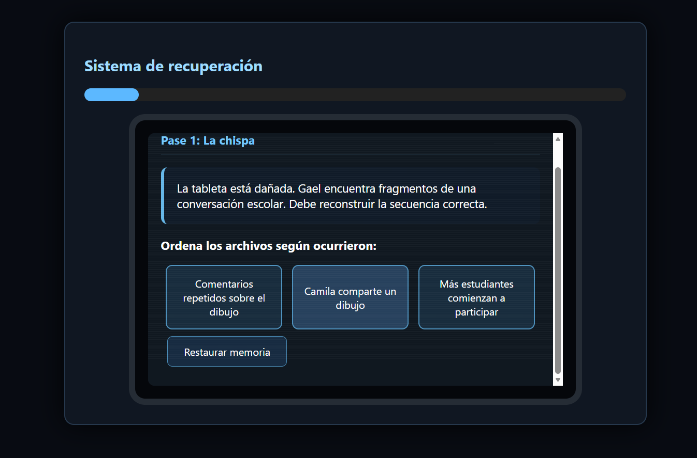
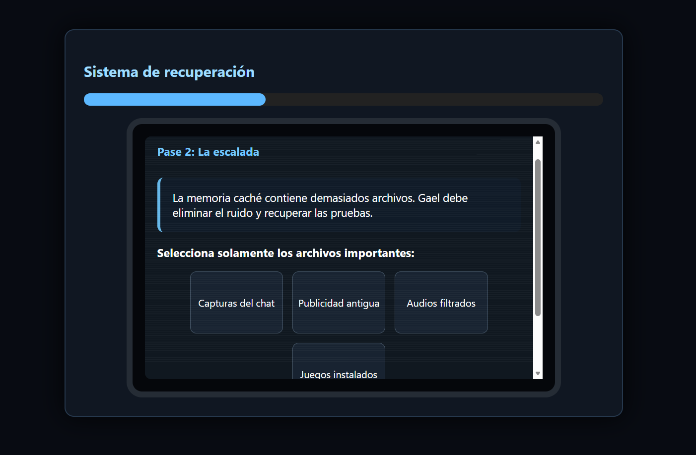
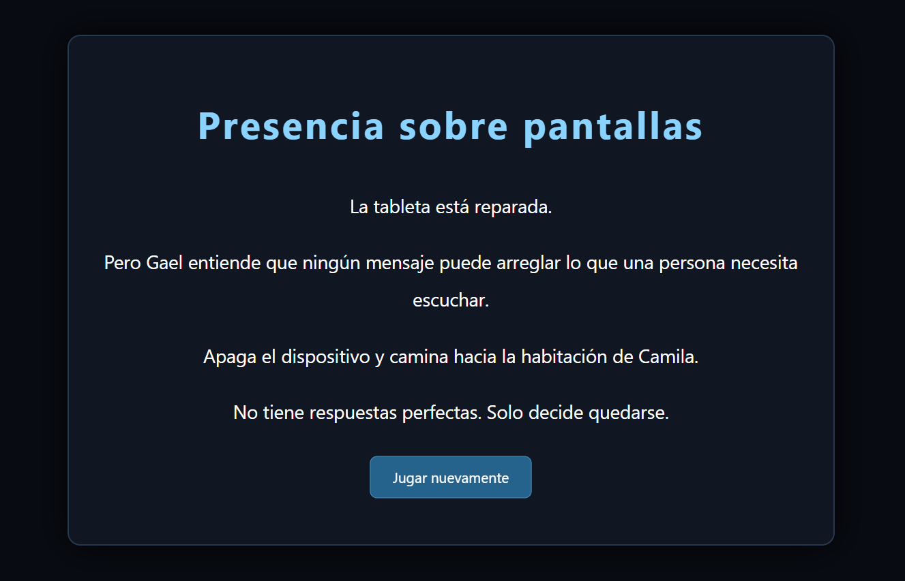

  # 🕯️ EL PESO DEL SILENCIO

  
  
  

  *Una experiencia narrativa donde recuperar archivos significa descubrir una verdad que permanecía oculta.*

---

## 📖 Descripción General

* **¿De qué trata?:** **El Peso del Silencio** es un videojuego web interactivo de exploración narrativa y resolución de rompecabezas enfocado en la concientización sobre el ciberbullying en adolescentes.

El jugador toma el papel de **Gael**, un joven de 17 años apasionado por reparar dispositivos electrónicos. Al intentar arreglar la tableta dañada de su hermana menor **Camila**, descubre una memoria corrupta llena de archivos fragmentados, conversaciones incompletas y registros ocultos que revelan progresivamente la situación de acoso digital que ella estaba viviendo.

* **Objetivo del jugador:** Restaurar los archivos dañados de la tableta para reconstruir la historia completa, comprender el impacto emocional del acoso virtual y desbloquear el archivo final que contiene la verdad detrás del silencio de Camila.

* **Mecánica principal:** El jugador debe avanzar mediante diferentes fases de recuperación digital donde tendrá que ordenar conversaciones cronológicamente, seleccionar archivos importantes dentro de la memoria del dispositivo y reconstruir mensajes no enviados. La experiencia combina investigación, resolución de acertijos y narrativa interactiva.

---

## 🎮 Género y Estilo

* **Géneros:** Narrativo / Puzzle / Aventura interactiva

* **Estilo Visual:** Simulación de una tableta dañada con una interfaz de sistema operativo corrupta. Presenta efectos de distorsión digital, pantallas oscuras, indicadores emocionales, archivos recuperables y elementos visuales inspirados en tecnología moderna.

* **Público Objetivo:** Adolescentes y jóvenes desde los 13 años interesados en experiencias narrativas, videojuegos educativos y temas de conciencia social.

---

## ⌨️ Controles

| Acción | Entrada |
| :--- | :--- |
| **Seleccionar archivos** | Clic del mouse / Pantalla táctil |
| **Ordenar fragmentos de conversación** | Seleccionar piezas en el orden correcto |
| **Filtrar archivos importantes** | Clic sobre elementos relevantes |
| **Avanzar en la historia** | Botones de interacción en pantalla |

---

## 🖼️ Capturas de Pantalla

| Vistas del Videojuego |
| :--- |
| **1. Pantalla Inicial / Introducción de la Historia**  |
| **2. Sistema de Recuperación de la Tableta**  |
| **3. Fase de Reconstrucción de Conversaciones**  |
| **4. Fase de Filtrado de Archivos**  |
| **5. Archivo Final y Revelación Narrativa**  |

---

## 🧩 Mecánicas y Fases del Juego

### **Fase 1: La Chispa**

El jugador debe reconstruir una conversación dañada organizando fragmentos en el orden correcto para descubrir cómo inició el problema.

**Objetivo:**
- Ordenar los eventos cronológicamente.
- Identificar el inicio del conflicto digital.

---

### **Fase 2: La Escalada**

La memoria de la tableta contiene múltiples archivos. El jugador debe distinguir información importante del contenido irrelevante.

**Objetivo:**
- Recuperar capturas de conversaciones.
- Seleccionar audios relevantes.
- Ignorar archivos innecesarios.

---

### **Fase 3: El Aislamiento**

El jugador encuentra borradores de mensajes que nunca fueron enviados y debe reconstruir el mensaje que Camila intentaba expresar.

**Objetivo:**
- Interpretar los fragmentos encontrados.
- Comprender el estado emocional del personaje.

---

### **Archivo Final**

Después de completar la recuperación, el jugador desbloquea el archivo definitivo y descubre la realidad detrás del silencio de Camila.

---

## 🛠️ Tecnologías y Herramientas Utilizadas

* **HTML5:**  
  Creación de la estructura del videojuego, pantallas de interacción y organización del contenido narrativo.

* **CSS3:**  
  Diseño visual de la interfaz de tableta, animaciones, efectos de distorsión, pantallas corruptas y elementos dinámicos.

* **JavaScript (Vanilla):**  
  Implementación de la lógica del juego, sistema de fases, selección de archivos, validación de respuestas, actualización de la barra emocional y control del flujo narrativo.

---

## 🤖 Elementos Desarrollados con Apoyo de IA

* **Diseño Conceptual y Narrativa (Gemini)**
  * Desarrollo de la historia centrada en el impacto del ciberbullying y la relación entre Gael y Camila.
  * Creación de las fases de investigación y estructura narrativa progresiva.
  * Diseño de mecánicas basadas en recuperación de información.

* **Programación y Diseño Interactivo (Claude):**
  * Implementación del sistema de recuperación de archivos.
  * Creación de la interfaz de tableta corrupta.
  * Desarrollo de la lógica de selección, validación y avance entre fases.

---

## 💡 Aprendizajes y Futuras Mejoras

* **Principales Aprendizajes:**
  * Desarrollo de una experiencia narrativa interactiva mediante HTML, CSS y JavaScript.
  * Creación de sistemas de decisiones y rompecabezas relacionados con una historia progresiva.
  * Diseño de interfaces digitales simulando sistemas operativos y dispositivos tecnológicos.

* **Mejoras planteadas para la versión 2.0:**
  * Añadir efectos de sonido ambientales y música narrativa.
  * Incorporar más finales dependiendo de las decisiones del jugador.
  * Agregar nuevas investigaciones y casos relacionados con seguridad digital.
  * Mejorar las animaciones de transición y efectos visuales.
