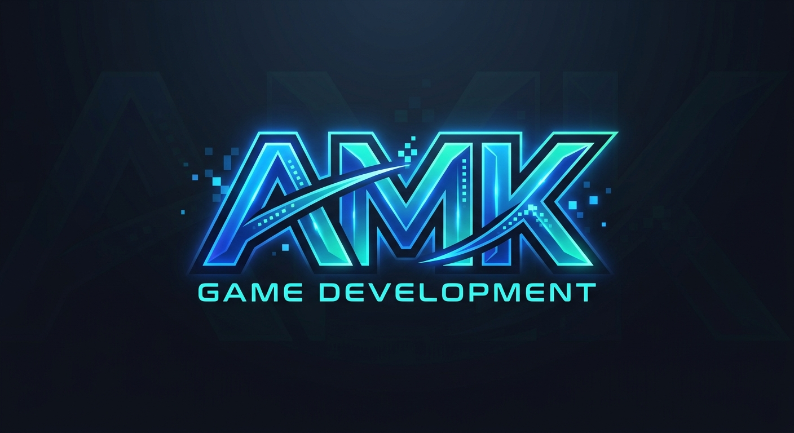

# Portafolio de Game Development AMK | DevLog & Prototipos

  

 
## 👤 Sobre Mí

Hola...! Soy **Andres Adonay Mamani Kantuta**, estudiante de la materia de **Game Development** de 4° Semestre de la carrera de Ingenieria en Sistemas Informaticos de La Universidad Privada del Valle.

* **Intereses:** Desarrollo de videojuegos en plataformas web, desarrollo de paginas web y aplicaciones moviles.
* **Géneros favoritos de videojuegos:** Platformers 2D, Metroidvanias, juegos de estrategia, moba, etc.
* **Herramientas de preferencia:** HTML, CSS, JavaScript, Git, Github.

---
## 🕹️ Galería de Videojuegos

### 1. Geometry Math

* **Descripción:** Runner educativo donde debes resolver operaciones matemáticas en tiempo real antes de impactar contra los bloques de respuesta.
* **Género:** Arcade / Puzzle Educativo / Runner
* **Tecnología:** HTML5 / CSS3 / JavaScript (Vanilla)
* **Enlaces:** [Ver Detalles del Juego](./GeometryMath/) | [Jugar Ahora!](https://andremka.github.io/AMK-Game-Development/GeometryMath/GeometryMath.html) 

---

### 2. ♻️ EcoSort: Desafío de Reciclaje

* **Descripción:** Videojuego educativo donde debes clasificar residuos en tiempo real dirigiendo su caída hacia el contenedor correcto antes de que toquen el suelo[cite: 1].
* **Género:** Arcade / Educativo / Habilidad[cite: 1]
* **Enlaces:** [Ver Detalles del Juego](./EcoSort/) | [Jugar Ahora!](https://andremka.github.io/AMK-Game-Development/EcoSort/EcoSort.html)
