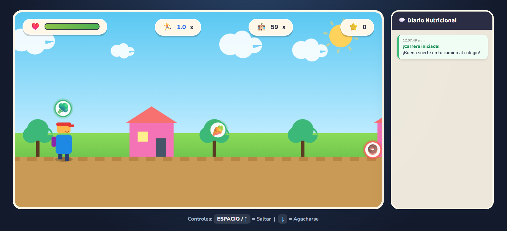
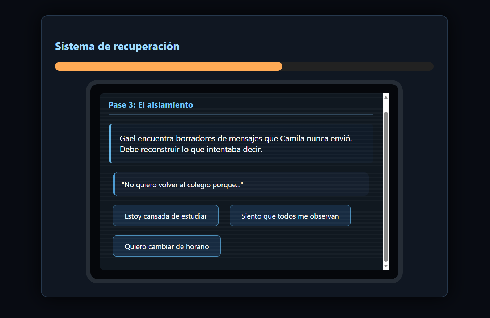

# Portafolio de Game Development AMK | DevLog & Prototipos

  
  
  
  

## 👤 Sobre Mí

Hola, que tal...! Soy **Andres Adonay Mamani Kantuta**, estudiante de **Ingeniería en Sistemas Informáticos** (4° Semestre) en la Universidad Privada del Valle (Univalle).

Apasionado por la tecnología y la creación de experiencias digitales interactivas. Mi enfoque actual combina el aprendizaje de **Game Development** con el **Desarrollo Web y Móvil**, teniendo como meta profesional consolidarme como **Desarrollador Fullstack**. Me motiva construir aplicaciones dinámicas, responsivas e intuitivas que resuelvan problemas reales o brinden entretenimiento de impacto.

* 🎯 **Aspiración:** Desarrollador Fullstack (Web & Mobile).
* 💡 **Áreas de Interés:** Desarrollo de videojuegos web 2D, aplicaciones móviles multiplataforma, interfaces web interactivas y lógica de backend.
* 🎮 **Géneros de Videojuegos Favoritos:** Platformers 2D, Metroidvanias, Estrategia, MOBAs y Puzzles Educativos.
* 🛠️ **Stack y Herramientas:** HTML5, CSS3, JavaScript (Vanilla / Canvas API), Git & GitHub.

---
## 🕹️ Galería de Videojuegos

### 1. Geometry Math

* **Descripción:** Runner educativo donde debes resolver operaciones matemáticas en tiempo real antes de impactar contra los bloques de respuesta.
* **Género:** Arcade / Puzzle Educativo / Runner
* **Tecnología:** HTML5 / CSS3 / JavaScript (Vanilla)
* **Enlaces:** [Ver Detalles del Juego](./GeometryMath/) | [Jugar Ahora!](https://andremka.github.io/AMK-Game-Development/GeometryMath/GeometryMath.html) 

---

### 2. ♻️ EcoSort: Desafío de Reciclaje

* **Descripción:** Videojuego educativo donde debes clasificar residuos en tiempo real dirigiendo su caída hacia el contenedor correcto antes de que toquen el suelo.
* **Género:** Arcade / Educativo / Habilidad
* **Enlaces:** [Ver Detalles del Juego](./EcoSort/) | [Jugar Ahora!](https://andremka.github.io/AMK-Game-Development/EcoSort/EcoSort.html)

---

### 3. 🏃 Nutri-Run: Camino al Colegio

* **Descripción:** Endless runner educativo donde debes correr hacia el colegio seleccionando alimentos saludables y esquivando comida chatarra para llegar con vitalidad.
* **Género:** Arcade / Endless Runner 2D / Educativo
* **Enlaces:** [Ver Detalles del Juego](./NutriRun/) | [Jugar Ahora!](https://andremka.github.io/AMK-Game-Development/NutriRun/NutriRun.html)

---

### 4. 💧 Water Guardian: La Última Reserva

* **Descripción:** Videojuego de estrategia y acción en tiempo real donde debes proteger la última fuente de agua potable controlando a un guardián con campo de ralentización, habilidades especiales y recolección de insumos.
* **Género:** Arcade / Estrategia / Supervivencia
* **Enlaces:** [Ver Detalles del Juego](./WaterGuardian/) | [Jugar Ahora!](https://andremka.github.io/AMK-Game-Development/WaterGuardian/WaterGuardian.html)

---

### 5. 🕯️ El Peso del Silencio

* **Descripción:** Videojuego narrativo de investigación y puzzles donde el jugador debe reparar una tableta corrupta para descubrir la historia oculta detrás del ciberbullying sufrido por Camila. Mediante la reconstrucción de conversaciones, filtrado de archivos y análisis de mensajes, deberá comprender el impacto del acoso digital.

* **Género:** Narrativo / Puzzle / Aventura Interactiva

* **Enlaces:** [Ver Detalles del Juego](./PesoDelSilencio/) | [Jugar Ahora!](https://andremka.github.io/AMK-Game-Development/PesoDelSilencio/Peso%20Del%20Silencio.html)

---

### 6. 💰 Defensa del Bolsillo Central

* **Descripción:** Videojuego educativo de estrategia tipo Tower Defense donde el jugador debe proteger su estabilidad financiera administrando un presupuesto limitado, construyendo defensas e invirtiendo recursos para enfrentar gastos inesperados, deudas y amenazas económicas.

* **Género:** Tower Defense / Estrategia / Educativo

* **Enlaces:** [Ver Detalles del Juego](./DefensaBancoCentral/) | [Jugar Ahora!](https://andremka.github.io/AMK-Game-Development/DefensaBancoCentral/Defensa%20Banco%20Central.html)
