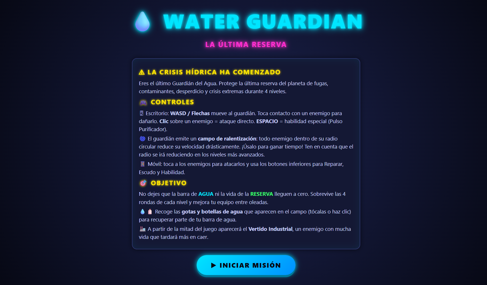
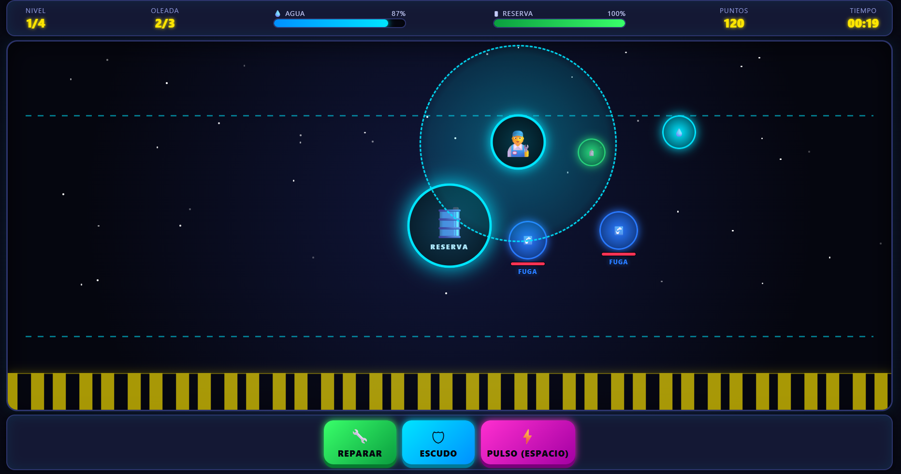
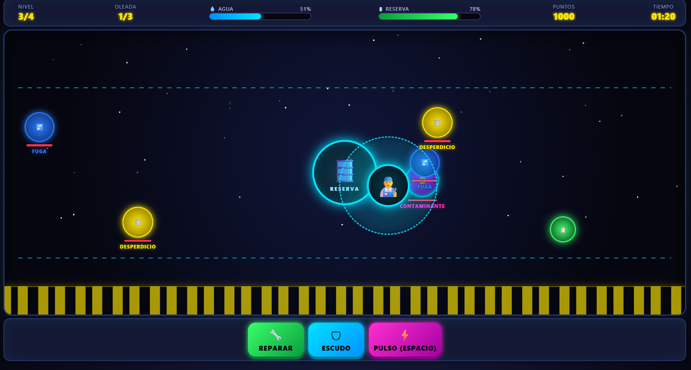
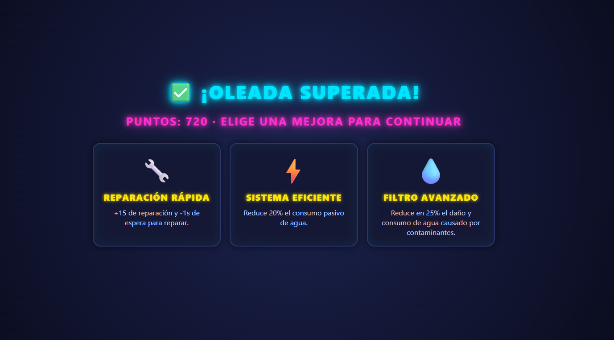
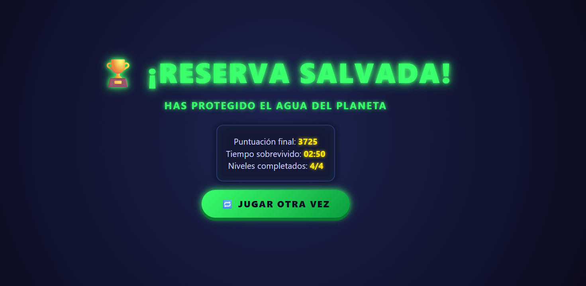
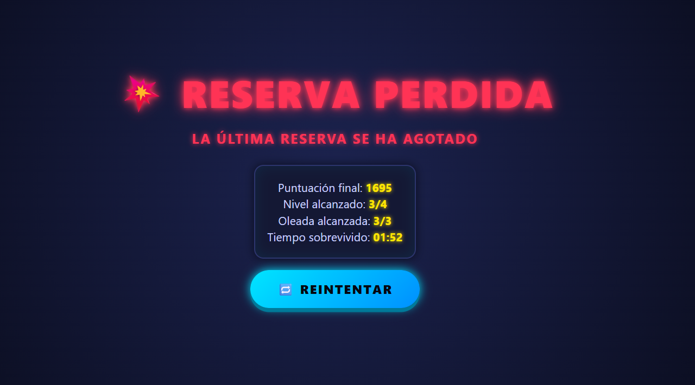

  # 💧 WATER GUARDIAN: LA ÚLTIMA RESERVA

  
  
  

  *Un desafío táctico en tiempo real para proteger la última fuente de agua potable del planeta.*

---

## 📖 Descripción General

* **¿De qué trata?:** **Water Guardian: La Última Reserva** es un videojuego web arcade de estrategia en tiempo real donde el jugador asume el papel del último guardián hídrico del planeta. Su misión es defender la **Reserva Central de Agua** frente a constantes amenazas como fugas, residuos contaminantes, desperdicio masivo y eventos extremos provocados por la crisis hídrica global.

* **Objetivo del jugador:** Mantener protegida la estructura de la **Reserva Central** y conservar el nivel de la barra de **Agua** durante las diferentes oleadas de enemigos. Para sobrevivir, el jugador debe eliminar amenazas, recolectar recursos y utilizar habilidades especiales en momentos estratégicos.

* **Mecánica principal:** El juego presenta un sistema de movimiento libre en un escenario 2D donde el guardián controla una zona de defensa. Posee un **campo de ralentización circular dinámico** que reduce la velocidad de los enemigos cercanos. Además, incorpora ataques directos, combate cuerpo a cuerpo, recolección de gotas de agua y habilidades con tiempo de enfriamiento como **Reparar**, **Escudo Protector** y **Pulso Purificador**.

---

## 🎮 Género y Estilo

* **Géneros:** Arcade / Estrategia en tiempo real / Supervivencia 2D

* **Estilo Visual:** Estética retro-futurista con una ambientación neón basada en colores cian, magenta, amarillo y verde brillante. Incluye fondos espaciales animados, partículas, efectos de energía, destellos y movimientos dinámicos para transmitir una sensación de emergencia constante.

* **Público Objetivo:** Jugadores de videojuegos arcade, estudiantes y público general desde los 10 años interesados en experiencias de habilidad, estrategia y concientización ambiental.

---

## ⌨️ Controles

| Acción | Teclado | Ratón / Pantalla Táctil |
| :--- | :--- | :--- |
| **Mover al Guardián** | `W`, `A`, `S`, `D` o `FLECHAS` | Clic / Toque directo en el escenario |
| **Ataque Directo** | — | Clic o toque sobre el enemigo |
| **Ataque Cuerpo a Cuerpo** | Colisión directa con enemigos | Mover al guardián sobre la amenaza |
| **Pulso Purificador** | `BARRA ESPACIADORA` | Botón ⚡ **PULSO** |
| **Reparar Reserva** | — | Botón 🔧 **REPARAR** |
| **Escudo Protector** | — | Botón 🛡 **ESCUDO** |
| **Recolectar Agua** | — | Clic / Toque sobre gotas 💧 y botellas 🧴 |

---

## 🖼️ Capturas de Pantalla

| Vistas del Videojuego |
| :--- |
| **1. Pantalla Inicial / Misión**  |
| **2. Momento de Gameplay y Campo de Ralentización**  |
| **3. Oleadas Avanzadas y Amenaza Industrial**  |
| **4. Pantalla de Selección de Mejoras**  |
| **5. Pantalla de Victoria (Reserva Salvada)**  |
| **6. Pantalla de Derrota (Reserva Perdida)**  |

---

## 🛠️ Tecnologías y Herramientas Utilizadas

* **HTML5 Canvas / DOM Rendering:**  
  Renderizado dinámico de enemigos, partículas, efectos visuales, barras de vida, indicadores de estado y elementos del HUD del videojuego.

* **CSS3 Avanzado:**  
  Implementación de variables CSS para la estética neón, animaciones mediante `@keyframes`, efectos de vibración, pulsos de peligro, movimientos del escenario y diseño responsive.

* **JavaScript (Vanilla ES6):**  
  Desarrollo del motor principal del juego mediante `requestAnimationFrame`, sistema de colisiones utilizando distancias euclidianas, generación progresiva de enemigos, administración de oleadas, habilidades con cooldown y gestión del estado general del juego.

---

## 🤖 Elementos Desarrollados con Apoyo de IA

* **Diseño Conceptual y Sistema de Juego (ChatGPT):**
  * Creación de la narrativa basada en la crisis hídrica mundial y definición del rol del jugador como guardián del último recurso de agua potable.
  * Diseño de enemigos como fugas, desperdicios, contaminantes, vertidos industriales y eventos de crisis extrema.
  * Diseño del sistema de habilidades, mejoras progresivas y balance de dificultad por niveles.

* **Programación y Arquitectura del Videojuego (Claude):**
  * Desarrollo del bucle principal del juego y la lógica de actualización en tiempo real.
  * Implementación del sistema de generación de enemigos mediante colas de aparición (`spawnQueue`).
  * Creación del campo de ralentización dinámico, físicas de interacción, controles táctiles y adaptación responsive.

---

## 💡 Aprendizajes y Futuras Mejoras

* **Principales Aprendizajes:**
  * Implementación de mecánicas de área mediante cálculos de distancia y optimización dentro del ciclo de renderizado.
  * Gestión de sistemas complejos combinando oleadas, habilidades, recursos, temporizadores y estados del jugador.
  * Diseño de una curva de dificultad progresiva mediante selección de mejoras entre niveles.

* **Mejoras planteadas para la versión 2.0:**
  * Incorporar efectos de sonido mediante Web Audio API para ataques, recolección, alarmas y eventos críticos.
  * Añadir un modo infinito de supervivencia con clasificación global de jugadores.
  * Crear nuevos guardianes con habilidades únicas y diferentes estilos de juego.
  * Implementar nuevos tipos de amenazas ambientales y escenarios relacionados con la crisis del agua.
